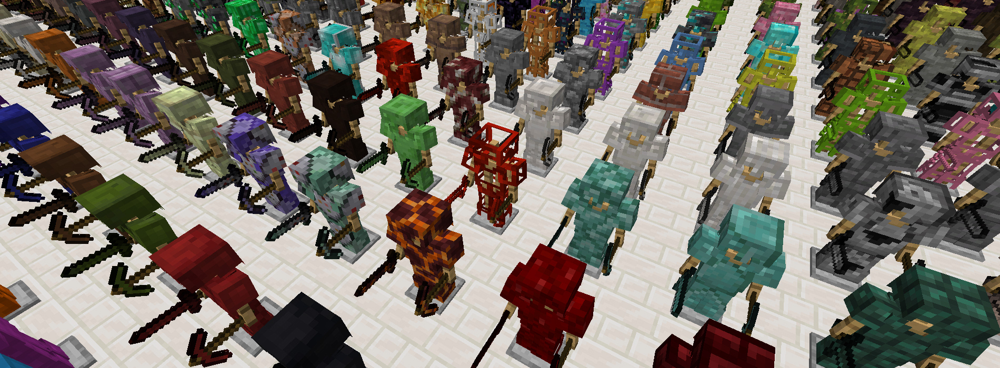

# Anything

Create tools and armor out of any block! This mod adds 3800+ tools and armor pieces to the game, for each of the blocks in the game.
The recipes are the same as their vanilla counterparts, but with the block of your choice.

Each of the materials has their own texture and stats, and a few of them have unique abilities. Download the mod from any of the links below:

- 
  [Get on Modrinth](https://modrinth.com/mod/anything)
- 
  [Get on CurseForge](https://www.curseforge.com/minecraft/mc-mods/anything-tools-armor)
- 
  [Get on Planet Minecraft](https://www.planetminecraft.com/mod/anything-6360331/)

Highly recommend using a mod such as [Polymorph](https://github.com/illusivesoulworks/polymorph) to prevent recipe
conflicts with vanilla tools and equipments as well as items from other mods.
You may also view the recipes using [EMI](https://github.com/emilyploszaj/emi) or other similar mods.

- [Official Website](https://luxmiyu.com/anything)
- [Discord Server](https://discord.gg/komimau)
- [GitHub Page](https://github.com/luxmiyu/anything)

If you have any questions or suggestions, feel free to reach out to me on Discord!